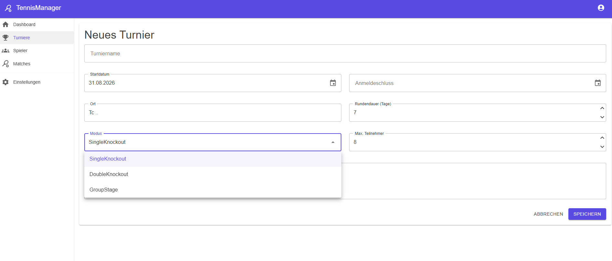
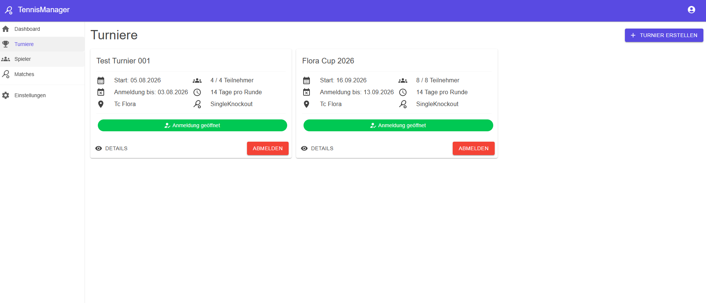
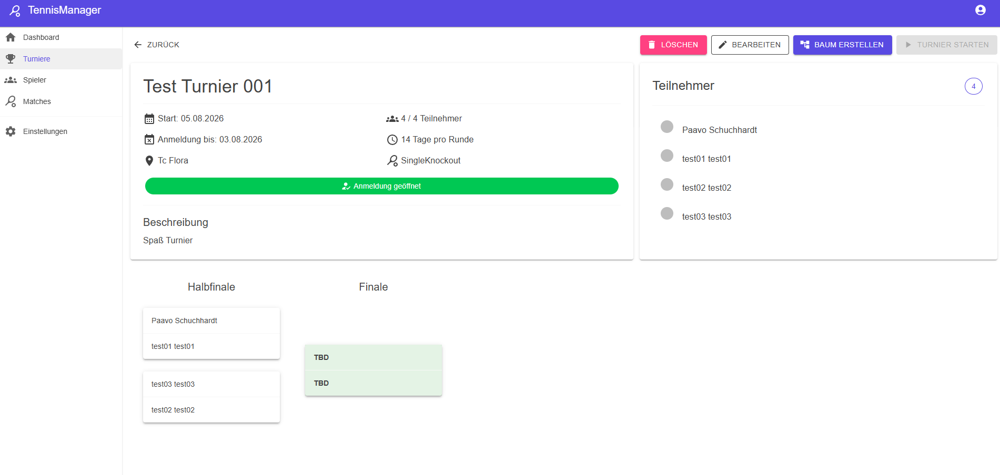
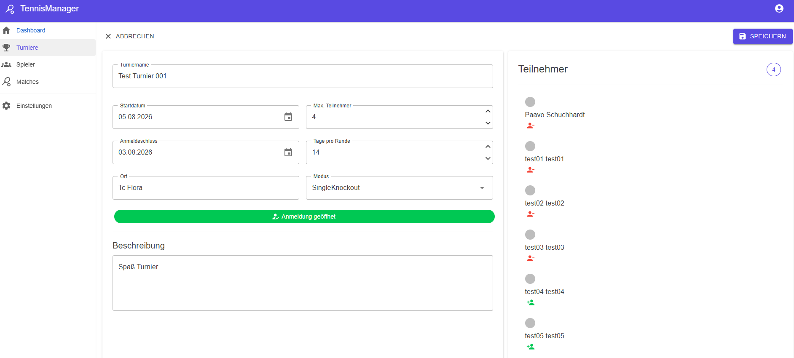

# 🎾 TennisManager

A web application for managing tennis tournaments, participants and matches.

> 🚧 This project is currently under active development.

## 📋 About the Project

The TennisManager is a web application developed with C# and .NET for managing tennis tournaments.

The application allows users to create and manage tournaments, register for tournaments and manage participants and matches. The project is being developed as a practical software development project to deepen my knowledge of modern .NET web development.

## ✨ Features

- 👤 User registration and authentication
- 🎾 Create and manage tournaments
- 👥 Manage tournament participants
- ✅ Register and unregister for tournaments
- 🏆 Tournament bracket
- ⚔️ Match management
- 🔄 Tournament round management
- 💾 Persistent data storage
- 🔐 User management with ASP.NET Core Identity

## 🛠️ Technologies

| Technology | Usage |
|---|---|
| C# | Programming language |
| .NET 8 | Application framework |
| Blazor | Web UI |
| ASP.NET Core | Web application framework |
| Entity Framework Core | Database access |
| ASP.NET Core Identity | Authentication & user management |
| SQL Server LocalDB | Database |
| MudBlazor | UI components |
| Git / GitHub | Version control |

## 🚀 Getting Started

### Prerequisites

- [.NET 8 SDK](https://dotnet.microsoft.com/download/dotnet/8.0)
- SQL Server LocalDB
- Git
- An IDE such as Visual Studio or Visual Studio Code

### Installation

Clone the repository:

```bash
git clone https://github.com/Toocy-CPU/TennisManager.git
```

Navigate to the project directory:

    cd TennisManager

Restore the required NuGet packages:

    dotnet restore

### Database Setup

The application uses SQL Server LocalDB together with Entity Framework Core.

Apply the existing migrations:

    dotnet ef database update

If the Entity Framework Core CLI tool is not installed:

    dotnet tool install --global dotnet-ef

### Run the Application

Start the application with:

    dotnet run

Alternatively, the project can be started directly from Visual Studio or Visual Studio Code.

The local URL will be displayed in the terminal after starting the application.

## 🏗️ Architecture

The application follows a layered approach where UI components, business logic and database access are separated.

Blazor components are responsible for the user interface, while services handle application logic and communication with the database.

Entity Framework Core is used for database access and migrations.

## 📊 Current Status

The TennisManager is currently under active development.

The core functionality for tournament management, participant management and match management is already implemented.

The next development steps focus on the complete tournament workflow and the handling of match and set results.

## 🔮 Planned Features

- [ ] Set result management
- [ ] Automatic match winner determination
- [ ] Automatic advancement to the next round
- [ ] Extended tournament logic
- [ ] Doubles tournaments
- [ ] Additional validation and permission handling
- [ ] Further UI improvements

## 🎯 Project Goals

The main goal of this project is to build a practical application while gaining hands-on experience with modern .NET technologies.

The project focuses on:

- Object-oriented programming with C#
- .NET and Blazor development
- Entity Framework Core
- Relational database design
- ASP.NET Core Identity
- UI development with MudBlazor
- Software architecture and separation of concerns
- Git and GitHub

## 📷 Screenshots

### Tournament Create



### Tournament Overview



### Tournament Details



### Tournament Edit



## 📄 License

This is a personal software development project.

No license for redistribution or commercial use has currently been defined.